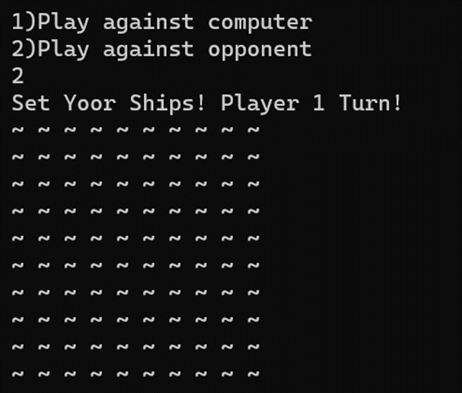
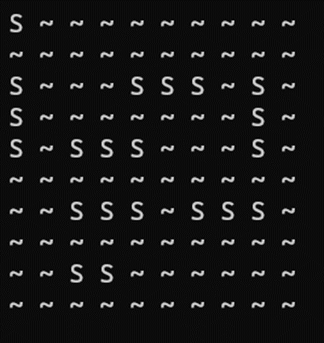
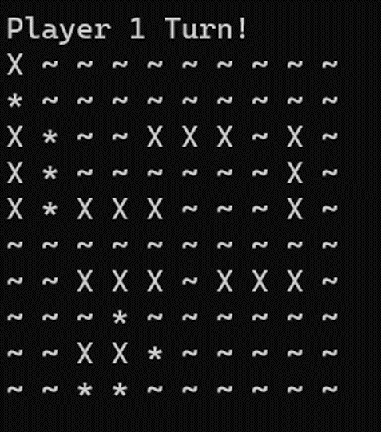
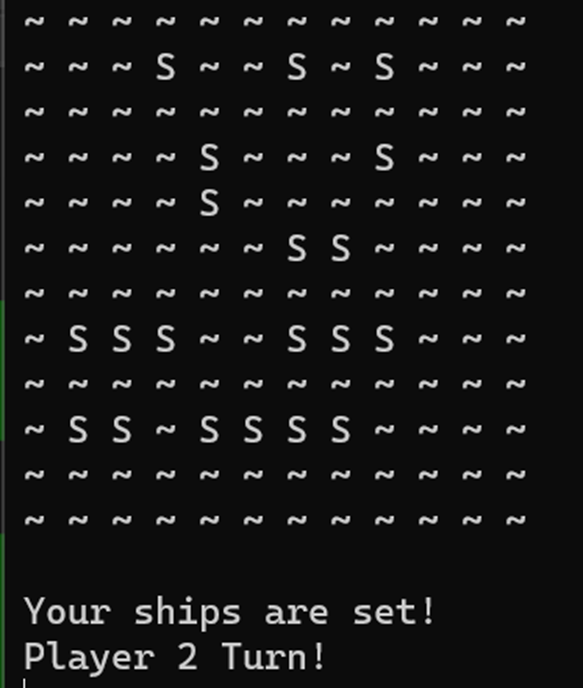

# Лабораторная работа №6 #

## Тема ##

Разработка консольного приложения в Windows.

## Вариант 4 ##

## Реализация/ход работы ##

## Цель работы ##

Научиться создавать простейшие классы-наследники.
Для выполнения лабораторной работы необходимо создать класс ***Window***. В классе должны быть следующие поля: ***id (int), height (int), width (int), memoryNeeded (int), areAdministatorRightsGranted (boolean) и isShown (boolean)***. Требуется реализовать конструктор, задающий ***id*** и принимающий параметры ***height, width и areAdministatorRightsGranted***, метод ***doWork***, в котором будет изменяться значение ***memoryNeeded*** и метод ***showOrHide***, меняющий значение переменной ***isShown***.
Затем необходимо создать класс-наследник класса Window по варианту, реализующий имитацию заданной функциональности.
Работу выполнять на языке C++.

### Условие ###

Создать консольный морской бой. Программа должна выводить в консоль игровые поля (корабли на поле оппонента должны быть скрыты) и иметь поддержку игры с компьютером (заполняет поле и делает ходы случайным образом, например).

lab6.cpp

```c++

Проверка на то, выставлены ли все корабли
bool checkNumberShip(char** grid) {
    bool all = false;
    int count = 1;
    for (int i = 0; i < ROWS; i++) {
        for (int j = 0; j < COLS; j++) {
            if (grid[i][j] == 'S')
                if (count == 20) {
                    all = true;
                    break;
                }
                else {
                    count++;
                }


        }
    }
    return all;


}

Инициализация доски
void initializeGrid(char **newGrid) {
    for (int i = 0; i < ROWS; i++)
    {
        newGrid[i] = new char[10];

    }
    for (int i = 0; i < ROWS; i++) {
        for (int j = 0; j < COLS; j++) {
            newGrid[i][j] = '~';
        }
    }
}

Установка кораблей 
void placeShips(char **grid) {
    int shipRow = 0;
    int shipCol = 0;
    char key;
    int c;
    do
    {
        c = 0;

        switch ((c = _getch())) {
        case 72:
            if (shipRow > 0) {
                shipRow--;
            }
            break;
        case 80:
            if (shipRow < ROWS - 1) {
                shipRow++;
            }
            break;
        case 75:
            if (shipCol > 0) {
                shipCol--;
            }
            break;
        case 77:
            if (shipCol < COLS - 1) {
                shipCol++;
            }
            break;
        case 13:
            if (!checkNumberShip(grid)) {
                setShip(shipRow, shipCol, grid);
                displayGrid(grid);

            }
            else {
                displayGrid(grid);
                cout << "Your ships are set!" << endl;

            }
           
            break;
        default:
            break;
        }
       

    } while (c != 27);
}
Выстрел
bool makeShot(int row, int col, char **gridHidden, char **gridEnemy, int& playerScore) {
    if (gridEnemy[row][col] == SHIP) {
        gridHidden[row][col] = KILLED;
        playerScore += 10;
        return true;


    }
    else {
        gridHidden[row][col] = MISSED;
        return false;
    }
}

Проверка на то, конец игры
bool checkEndofGame(int score) {
    if (score == 200) {
        cout << "End of game"<<endl;
        if (player1Score == 200) {
            cout << "Player 1 has won!" << endl;
        }
        else {
            cout << "Player 2 has won!" << endl;


        }
        return true;
    }
    return false;
}

Прицеливание
void shoot(char **gridHidden,char **gridEnemy,int& playerScore) {
    int shipRow = 0;
    int shipCol = 0;
    char key;
    int c;
    bool yes = true;
    do
    {
        c = 0;

        switch ((c = _getch())) {
        case 72:
            if (shipRow > 0) {
                shipRow--;
            }
            break;
        case 80:
            if (shipRow < ROWS - 1) {
                shipRow++;
            }
            break;
        case 75:
            if (shipCol > 0) {
                shipCol--;
            }
            break;
        case 77:
            if (shipCol < COLS - 1) {
                shipCol++;
            }
            break;
        case 13:
            yes = makeShot(shipRow, shipCol, gridHidden,gridEnemy,playerScore);
            displayGrid(gridHidden);
            break;
        default:
            break;
        }

    } while (yes);
}

Проверка на правильное взаиморасположение кораблей


int checkPosition(int i, int j, int sizeOfShip, int orientation, char** grid)
{

    if (orientation != 120)
    {
        if (i + sizeOfShip-1 > ROWS - 2) {
            return false;
        }
        else {

            for (int k = 0; k < sizeOfShip; k++)
            {
                if (grid[i + k][j] == 'S' || grid[i + k - 1][j] == 'S' || grid[i + k + 1][j] == 'S' ||
                    grid[i + k - 1][j - 1] == 'S' || grid[i + k][j - 1] == 'S' || grid[i + k + 1][j - 1] == 'S' ||
                    grid[i + k - 1][j + 1] == 'S' || grid[i + k][j + 1] == 'S' || grid[i + k + 1][j + 1] == 'S')

                {
                    return false;
                }
            }
        }

    }


    else
    {
        if (j + sizeOfShip-1 > COLS - 2) {
            return false;
        }
        else {
            for (int k = 0; k < sizeOfShip; k++)
            {
                if (grid[i][j + k] == 'S' || grid[i - 1][j + k] == 'S' || grid[i + 1][j + k] == 'S' ||
                    grid[i - 1][j + k - 1] == 'S' || grid[i][j + k - 1] == 'S' || grid[i + 1][j + k - 1] == 'S' ||
                    grid[i - 1][j + k + 1] == 'S' || grid[i][j + k + 1] == 'S' || grid[i + 1][j + k + 1] == 'S')
                {
                    return false;
                }
            }
        }
        }
    
    return true;

}

```

#### Результаты работы ####







#### Вывод ####

Создала консольный морской бой. Программа должна выводить в консоль игровые поля (корабли на поле оппонента должны быть скрыты) и иметь поддержку игры с компьютером (заполняет поле и делает ходы случайным образом, например).

